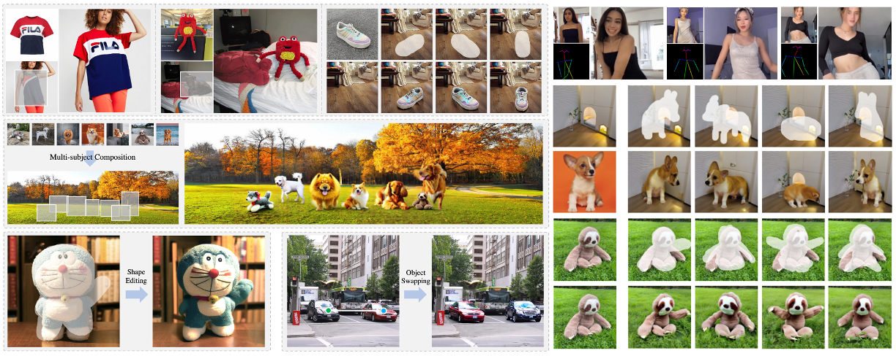
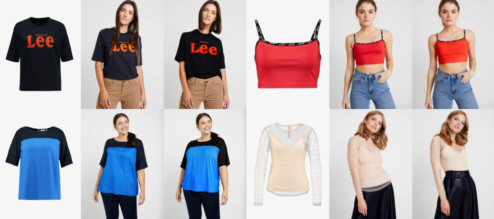
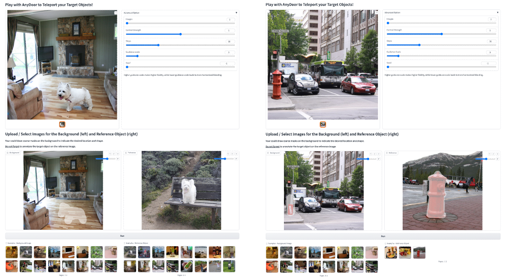

<p align="center">

  <h2 align="center">AnyDoor: Zero-shot Object-level Image Customization</h2>
  <p align="center">
    <a href="https://xavierchen34.github.io/"><strong>Xi Chen</strong></a>
    ·
    <a href="https://scholar.google.com/citations?user=JYVCn3AAAAAJ&hl=en"><strong>Lianghua Huang</strong></a>
    ·
    <a href="https://scholar.google.com/citations?user=8zksQb4AAAAJ&hl=zh-CN"><strong>Yu Liu</strong></a>
    ·
    <a href="https://shenyujun.github.io/"><strong>Yujun Shen</strong></a>
    ·
    <a href="https://scholar.google.com/citations?user=7LhjCn0AAAAJ&hl=en"><strong>Deli Zhao</strong></a>
    ·
    <a href="https://hszhao.github.io/"><strong>Hengshuang Zhao</strong></a>
    <br>
    <br>
        <a href="https://arxiv.org/abs/2307.09481"></a>
        <a href='https://ali-vilab.github.io/AnyDoor-Page/'></a>
        <a href='https://modelscope.cn/studios/damo/AnyDoor-online/summary'></a>
        <a href='https://huggingface.co/spaces/xichenhku/AnyDoor-online'></a>
        <a href='https://replicate.com/lucataco/anydoor'></a>
    <br>
    <b>The University of Hong Kong &nbsp; | &nbsp;  Alibaba Group  | &nbsp;  Ant Group </b>
  </p>
  
  <table align="center">
    <tr>
    <td>
      
    </td>
    </tr>
  </table>

## News
* **[2023.12.17]** Release train & inference & demo code, and pretrained checkpoint.
* **[2023.12.24]** 🔥 Support online demo on [ModelScope](https://modelscope.cn/studios/damo/AnyDoor-online/summary) and 
 [HuggingFace](https://huggingface.co/spaces/xichenhku/AnyDoor-online).
* **[Soon]** Release the new version paper.
* **[On-going]** Scale-up the training data and release stronger models as the foundaition model for downstream region-to-region generation tasks.
* **[On-going]** Release specific-designed models for downstream tasks like virtual tryon, face swap, text and logo transfer, etc.


## Installation
Install with `conda`: 
```bash
conda env create -f environment.yaml
conda activate anydoor
```
or `pip`:
```bash
pip install -r requirements.txt
```
Additionally, for training, you need to install panopticapi, pycocotools, and lvis-api.
```bash
pip install git+https://github.com/cocodataset/panopticapi.git

pip install pycocotools -i https://pypi.douban.com/simple

pip install lvis
```
## Download Checkpoints
Download AnyDoor checkpoint: 
* [ModelScope](https://modelscope.cn/models/damo/AnyDoor/files)
* [HuggingFace](https://huggingface.co/spaces/xichenhku/AnyDoor/tree/main)

**Note:** We include all the optimizer params for Adam, so the checkpoint is big. You could only keep the "state_dict" to make it much smaller.


Download DINOv2 checkpoint and revise `/configs/anydoor.yaml` for the path (line 83)
* URL: https://github.com/facebookresearch/dinov2?tab=readme-ov-file

Download Stable Diffusion V2.1 if you want to train from scratch.
* URL: https://huggingface.co/stabilityai/stable-diffusion-2-1/tree/main


## Inference
We provide inference code in `run_inference.py` (from Line 222 - ) for both inference single image and inference a dataset (VITON-HD Test). You should modify the data path and run the following code. The generated results are provided in `examples/TestDreamBooth/GEN` for single image, and `VITONGEN` for VITON-HD Test.

```bash
python run_inference.py
```
The inferenced results on VITON-Test would be like [garment, ground truth, generation].

*Noticing that AnyDoor does not contain any specific design/tuning for tryon, we think it would be helpful to add skeleton infos or warped garment, and tune on tryon data to make it better :)*
  <table align="center">
    <tr>
    <td>
      
    </td>
    </tr>
  </table>


Our evaluation data for DreamBooth an COCOEE coud be downloaded at Google Drive:
* URL: [to be released]


## Gradio demo 
Currently, we suport local gradio demo. To launch it, you should firstly modify `/configs/demo.yaml` for the path to the pretrained model, and `/configs/anydoor.yaml` for the path to DINOv2(line 83). 

Afterwards, run the script:
```bash
python run_gradio_demo.py
```
The gradio demo would look like the UI shown below:

* 📢 This version requires users to annotate the mask of the target object, too coarse mask would influence the generation quality. We plan to add mask refine module or interactive segmentation modules in the demo.

* 📢 We provide an segmentation module to refine the user annotated reference mask. We could chose to disable it by setting  `use_interactive_seg: False` in `/configs/demo.yaml`.

<table align="center">
  <tr>
  <td>
    
  </td>
  </tr>
</table>

## Train

### Prepare datasets
* Download the datasets that present in `/configs/datasets.yaml` and modify the corresponding paths.
* You could prepare you own datasets according to the formates of files in `./datasets`.
* If you use UVO dataset, you need to process the json following `./datasets/Preprocess/uvo_process.py`
* You could refer to `run_dataset_debug.py` to verify you data is correct.


### Prepare initial weight
* If your would like to train from scratch, convert the downloaded SD weights to control copy by running:
```bash
sh ./scripts/convert_weight.sh  
```
### Start training
* Modify the training hyper-parameters in `run_train_anydoor.py` Line 26-34 according to your training resources. We verify that using 2-A100 GPUs with batch accumulation=1 could get satisfactory results after 300,000 iterations.


* Start training by executing: 
```bash
sh ./scripts/train.sh  
```

## 🔥 Community Contributions
@bdsqlsz

* AnyDoor for windows: https://github.com/sdbds/AnyDoor-for-windows
* Pruned model: https://modelscope.cn/models/bdsqlsz/AnyDoor-Pruned/summary

## Acknowledgements
This project is developped on the codebase of [ControlNet](https://github.com/lllyasviel/ControlNet). We  appreciate this great work! 


## Citation
If you find this codebase useful for your research, please use the following entry.
```BibTeX
@article{chen2023anydoor,
  title={Anydoor: Zero-shot object-level image customization},
  author={Chen, Xi and Huang, Lianghua and Liu, Yu and Shen, Yujun and Zhao, Deli and Zhao, Hengshuang},
  journal={arXiv preprint arXiv:2307.09481},
  year={2023}
}
```
